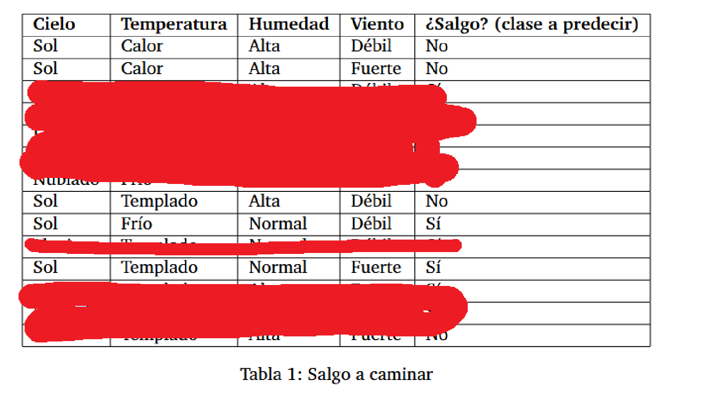
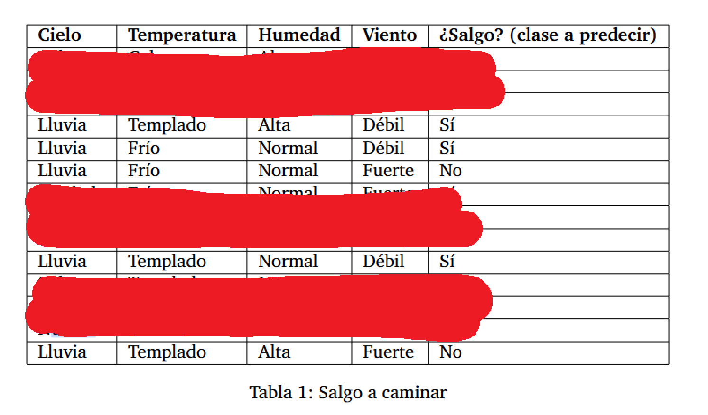
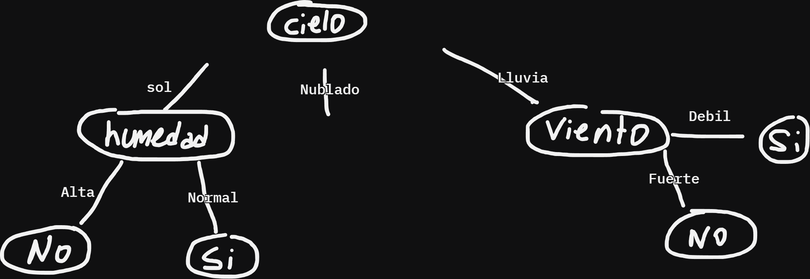
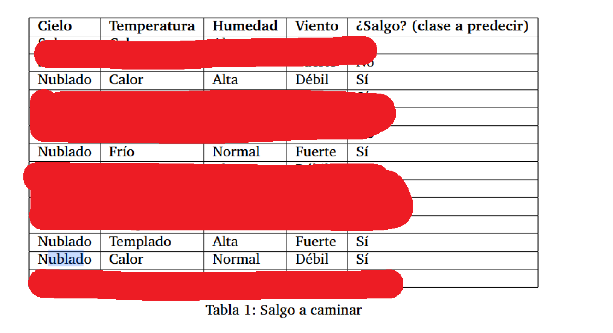
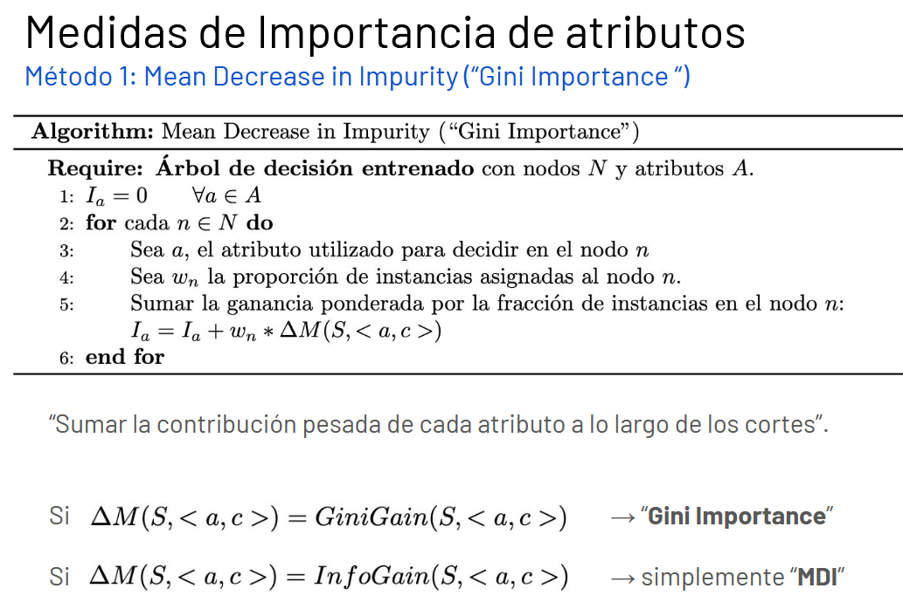
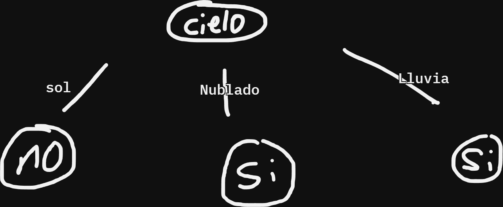
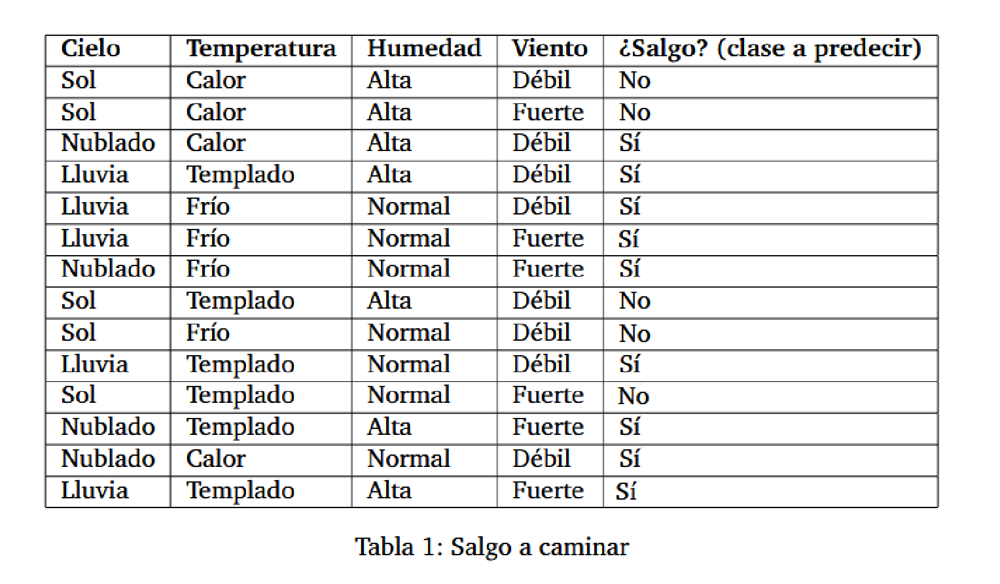

# Guia 3

## Ejercicio 1

### a

Calculamos primero la entropia de toda la región con respecto a la clase a predecir (salir o no salir):

- Cantidad de datos: 14
- Cantidad de datos positivos (salgo): 9
- Cantidad de datos negativos (No salgo): 5 

$H(S)= - 9/14 * log_2(9/14) - 5/14 * log_2(5/14) \approx 0.94029$

Ahora calculo la ganancia de información de cada atributo:

> Cielo

$InfoGain(S, Cielo) = H(S) - (Prop_{(Cielo=sol)} * H(S_{Cielo=sol}) + Prop_{(Cielo=Nublado)} * H(S_{Cielo=Nublado}) + Prop_{(Cielo=Lluvia)} * H(S_{Cielo=LLuvia}))$

$Prop_{(Cielo=Sol)} = 5/14$

$Prop_{(Cielo=Nublado)} = 4/14$

$Prop_{(Cielo=Lluvia)} = 5/14$

El calculo de las entropias es respecto a la clase a clasificar (salgo o no) pero restringido al espacio muestral conrrespondiente al valor de Cielo.

$H(S_{Cielo=Sol}) = - 3/5 * log_2(3/5) - 2/5 * log_2(2/5) \approx 0.970951$

$H(S_{Cielo=Nublado}) = - 4/4 * log_2(4/4) - 0/4 * log_2(0/4) = 0$

$H(S_{Cielo=Lluvia}) = - 3/5 * log_2(3/5) - 2/5 * log_2(2/5) \approx 0.970951$

$InfoGain(S, temperatura) = 0.94029 - (5/14 * 0.970951 + 4/14 * 0 + 5/14 * 0.970951) \approx 0.24675$

> Temperatura

$InfoGain(S, temperatura) = H(S) - (Prop_{(Temp=calor)} * H(S_{temp=calor}) + Prop_{(Temp=templado)} * H(S_{temp=templado}) + Prop_{(Temp=Frio)} * H(S_{temp=Frio}))$

$Prop_{(Temp=calor)} = 4/14$

$Prop_{(Temp=templado)} = 6/14$

$Prop_{(Temp=frio)} = 4/14$

$H(S_{temp=calor}) = - 2/4 * log_2(2/4) - 2/4 * log_2(2/4) = 1$

$H(S_{temp=templado}) = - 2/6 * log_2(2/6) - 4/6 * log_2(4/6) \approx 0.918296$

$H(S_{temp=Frio}) = - 3/4 * log_2(3/4) - 1/4 * log_2(1/4) \approx 0.811278$

$InfoGain(S, temperatura) = 0.94029 - (4/14 * 1 + 6/14 * 0.918296 + 4/14 * 0.811278) \approx 0.029227$

> Humedad

$InfoGain(S, Humedad) = H(S) - (Prop_{(Humedad=Alta)} * H(S_{Humedad=alta}) + Prop_{(Humedad=Normal)} * H(S_{Humedad=normal}))$

$Prop_{(Humedad=normal)} = 7/14$

$Prop_{(Humedad=alta)} = 7/14$

$H(S_{Humedad=normal}) = - 6/7 * log_2(6/7) - 1/7 * log_2(1/7) \approx 0.591673$

$H(S_{Humedad=alta}) = - 3/7 * log_2(3/7) - 4/7 * log_2(4/7) \approx 0.985228$

$InfoGain(S, Humedad) = 0.94029 - (7/14 * 0.985228 + 7/14 * 0.591673) \approx 0.15184$

> Viento

$InfoGain(S, Humedad) = H(S) - (Prop_{(Viento=debil)} * H(S_{Viento=debil}) + Prop_{(Viento=fuerte)} * H(S_{Viento=fuerte}))$

$Prop_{(Viento=debil)} = 8/14$

$Prop_{(Viento=fuerte)} = 6/14$

$H(S_{Viento=debil}) = - 6/8 * log_2(6/8) - 1/8 * log_2(1/8) \approx 0.686278$

$H(S_{Viento=fuerte}) = - 3/6 * log_2(3/6) - 3/6 * log_2(3/6) \approx 1$

$InfoGain(S, Viento) = 0.94029 - (8/14 * 0.686278 + 6/14 * 1) \approx 0.119559$

Entonces el atributo que mayor information gain aporta es Cielo.

En este paso se armaria el primer nodo representando la Cielo y saldrian 3 ramas, una para cada valor (Sol, nublado y lluvia). En cada rama se pondria un nuevo nodo y se haria otra iteración de los calculos que acabamos de hacer. Como estamos en el caso de atributos con valores discretos, se omite cielo para los nodos nuevos.

Calculemos la entropia para la rama sol $H(S_{cielo=sol})$. Notar que ya la habiamso calculado antes y daba $\approx 0.970951$

Ahora analicemos la ganancia de informacion de los demas atributos condicional a cielo=sol para elegir el siguiente atributo en el árbol.

Viendo los datos restringidos a cielo=sol

Vmmos que las clases de humedad tienen entropia 0 (Alta clasifica siempre en No y Normal siempre en si). Y los demas atributos tienen entropia > 0 al clasificar algunas como no y otras como si en cada valor del atributo. Por lo que humedad en esta rama es el que mayor información gana, y es el que usaremos para cielo = sol.

Mas aún, desde este nuevo nodo humedad sacaremos 2 ramas hojas con la clasificación No para humedad alta y si para humedad normal. 

Hasta ahora el árbol quedaría:

Continuando con otra rama de cielo, si nos restringimos a cielo = lluvia podemos apreciar un caso similar al anterior:

Donde para valores de viento = debol se clasifica en Si y Viento = Fuerte en No. (Numéricamente se tiene entropia 0, y con los otros atributos entropia > 0).

Y por ultimo si vemos los datos restringidos a cielo = Nublado

vemos que hay entropia 0 (que realmente ya lo habiamos visto en el calculo). Por lo que solo debemos agregar un nodo hoja con el valor de la clasificación: Si.

Estos ultimos pasos los hice viendo los datos porque son pocos y evidentes. Pero el algoritmo tendria que calcular en cada nuevo que crea, la entropia por cada atributo posible a usar en dicho camino y elegir el de mayor information gain (esto es lo pude hacer a ojo ya que habia atributos que tenian entropia 0 y por lo tanto information gain máxima).

### b

- {Sol, frio, Normal, debil} = Si
- (Nublado, Calor, Alta, Fuerte) = Si
- (Lluvia, Normal, Alta, Fuerte) = No 

### c

Fórmula de gini: $Gini(S) = 1-\sum_{k \in clases(k)} p(k)^2$

Fórmula ganancia gini: $GiniGain(S, <a,c>) = Gini(S) - (Prop_\leq * Gini(S_\leq) + Prop_> * Gini(S_>))$

Interpretación: 
- gini de un nodo: que tan impuro es (si el nodo tiene elementos de una sola de las clases entonces es puro)
- ganancia gini: cuanta impureza se elimina al hacer el corte por un atributo por algun valor en concreto $<a,c>$ (valores continuos o discretos).

Algoritmo para calcular disminución media de la impureza: 

- Empezamos calculando gini en la raiz: $Gini(S) = 1-((5/14)^2 + (9/14)^2) \approx 0.45918$

- Ahora calculamos el GiniGain de haber usado el cielo como primer atributo en el árbol: 
  $Gini(S_{cielo=sol}) = 1 - ((2/5)^2 + (3/5)^2) = 0.48$  
  $Gini(S_{cielo=nublado}) = 1 - ((4/4)^2 + (0/4)^2) = 0$  
  $Gini(S_{cielo=lluvia}) = 1 - ((3/5)^2 + (2/5)^2) = 0.48$
  $GiniGain(S, cielo) = 0.45918 - ((5/14)*0.48  + (4/14)*0 + (5/14)*0.48) \approx 0.116323$

- La proporción de elementos sobre el total de instancias es 1, ya que es la primer partición: $w_{cielo} = 14/14 = 1$. Por lo tanto la importancia del atributo cielo es $I_{cielo} = 0.116323$

---

- Continuamos con la importancia en el siguiente nodo, correspondiente a la humedad. Aca la cantidad de instancias se reduce a aquellas con cielo=sol. Es decir, 5/14.
- $Gini(S_{cielo=sol, humedad=alta}) = 1 - ((3/3)^2 + (0/3)^2) = 0$    
  $Gini(S_{cielo=sol, humedad=normal}) = 1 - ((2/2)^2 + (0/2)^2) = 0$    
- 
$$
\begin{align*}
GiniGain(S_{sol}, humedad) &= Gini(S_{sol}) - (3/5 * Gini(S_{sol, humedad=alta}) + 2/5 * Gini(S_{sol, humedad=normal})) \\
GiniGain(S_{sol}, humedad) &= 0.48 - (3/5 * 0 + 2/5 * 0) = 0.48
\end{align*}
$$ 
- Entonces la importancia del atributo humedad es $I_{humedad} = 5/14 * 0.48 \approx 0.17143$

---

- Seguimos con el atributo Viento con proporción correspondiente a cielo=lluvia: 5/14
- $Gini(S_{cielo=lluvia, Viento=debil}) = 1 - ((3/3)^2 + (0/3)^2) = 0$    
  $Gini(S_{cielo=lluvia, Viento=fuerte}) = 1 - ((2/2)^2 + (0/2)^2) = 0$   
$$
\begin{align*}
GiniGain(S_{lluvia}, Viento) &= Gini(S_{lluvia}) - (3/5 * Gini(S_{lluvia, Viento=devil}) + 2/5 * Gini(S_{lluvia, Viento=fuerte})) \\
GiniGain(S_{lluvia}, Viento) &= 0.48 - (3/5 * 0 + 2/5 * 0) = 0.48
\end{align*}
$$ 

- Entonces la importancia del atributo viento es igual al de humedad: $I_{viento} = 5/14 * 0.48 \approx 0.17143$

---

- Finalmente la importancia de la temperatura para este árbol es 0 al tener proporción 0 de las instancias para todos sus posibles valores (no se usó el atributo en la construcción del árbol):
- $I_{temperatura} = \sum_{\text{Nodos donde se usa temperatura}} \frac{N_i}{N} * GiniGain_i$. Es decir, la suma de las ganancias por usar dicha atributo en un nodo ponderado a la proporción de instancias en esa altura del árbol.
- Que para temperatura es $I_{temperatura}=\sum_{0} = 0$
  

### d

Habria que definir que hacer con las ramas que se pasan en altura (caso cielo = sol y lluvia = viento). Por ejemplo si tomamos el valor de clasificación como la mayoria de la clase quedaría el siguiente arbol:

Esto provoca que algunos de los datos de entrenamiento se clasifiquen mal.

Son 4 clasificaciones erroneas.