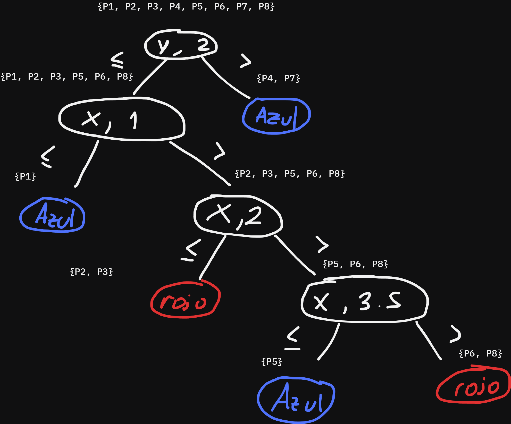
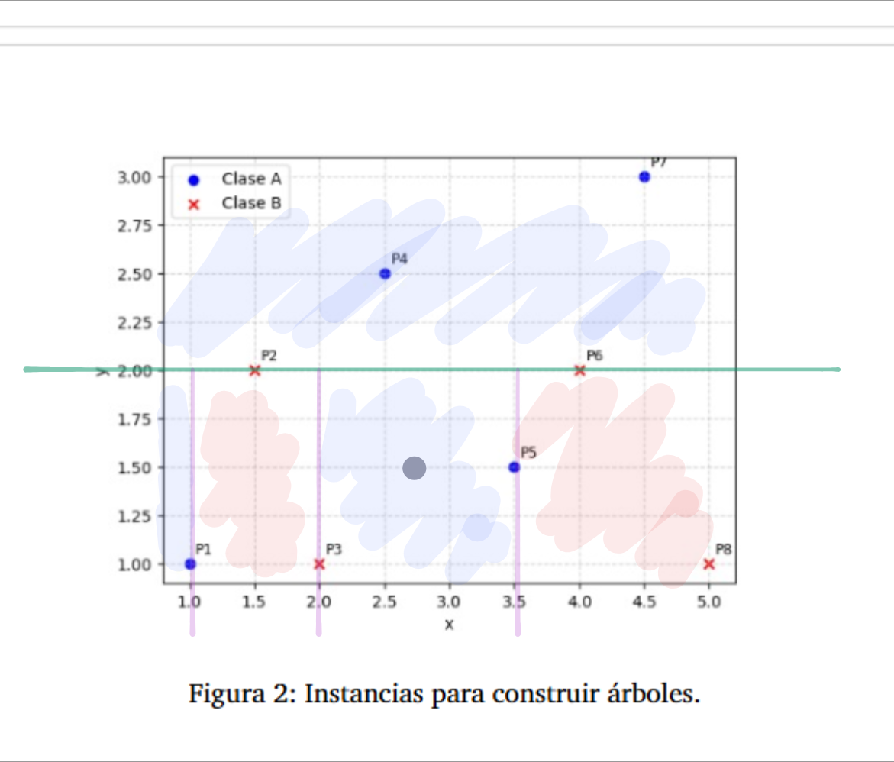

# Guia 3

## Ejercicio 1

### a

Calculamos primero la entropia de toda la región con respecto a la clase a predecir (salir o no salir):

- Cantidad de datos: 14
- Cantidad de datos positivos (salgo): 9
- Cantidad de datos negativos (No salgo): 5 

$H(S)= - 9/14 * log_2(9/14) - 5/14 * log_2(5/14) \approx 0.94029$

Ahora calculo la ganancia de información de cada atributo:

> Cielo

$InfoGain(S, Cielo) = H(S) - (Prop_{(Cielo=sol)} * H(S_{Cielo=sol}) + Prop_{(Cielo=Nublado)} * H(S_{Cielo=Nublado}) + Prop_{(Cielo=Lluvia)} * H(S_{Cielo=LLuvia}))$

$Prop_{(Cielo=Sol)} = 5/14$

$Prop_{(Cielo=Nublado)} = 4/14$

$Prop_{(Cielo=Lluvia)} = 5/14$

El calculo de las entropias es respecto a la clase a clasificar (salgo o no) pero restringido al espacio muestral conrrespondiente al valor de Cielo.

$H(S_{Cielo=Sol}) = - 3/5 * log_2(3/5) - 2/5 * log_2(2/5) \approx 0.970951$

$H(S_{Cielo=Nublado}) = - 4/4 * log_2(4/4) - 0/4 * log_2(0/4) = 0$

$H(S_{Cielo=Lluvia}) = - 3/5 * log_2(3/5) - 2/5 * log_2(2/5) \approx 0.970951$

$InfoGain(S, temperatura) = 0.94029 - (5/14 * 0.970951 + 4/14 * 0 + 5/14 * 0.970951) \approx 0.24675$

> Temperatura

$InfoGain(S, temperatura) = H(S) - (Prop_{(Temp=calor)} * H(S_{temp=calor}) + Prop_{(Temp=templado)} * H(S_{temp=templado}) + Prop_{(Temp=Frio)} * H(S_{temp=Frio}))$

$Prop_{(Temp=calor)} = 4/14$

$Prop_{(Temp=templado)} = 6/14$

$Prop_{(Temp=frio)} = 4/14$

$H(S_{temp=calor}) = - 2/4 * log_2(2/4) - 2/4 * log_2(2/4) = 1$

$H(S_{temp=templado}) = - 2/6 * log_2(2/6) - 4/6 * log_2(4/6) \approx 0.918296$

$H(S_{temp=Frio}) = - 3/4 * log_2(3/4) - 1/4 * log_2(1/4) \approx 0.811278$

$InfoGain(S, temperatura) = 0.94029 - (4/14 * 1 + 6/14 * 0.918296 + 4/14 * 0.811278) \approx 0.029227$

> Humedad

$InfoGain(S, Humedad) = H(S) - (Prop_{(Humedad=Alta)} * H(S_{Humedad=alta}) + Prop_{(Humedad=Normal)} * H(S_{Humedad=normal}))$

$Prop_{(Humedad=normal)} = 7/14$

$Prop_{(Humedad=alta)} = 7/14$

$H(S_{Humedad=normal}) = - 6/7 * log_2(6/7) - 1/7 * log_2(1/7) \approx 0.591673$

$H(S_{Humedad=alta}) = - 3/7 * log_2(3/7) - 4/7 * log_2(4/7) \approx 0.985228$

$InfoGain(S, Humedad) = 0.94029 - (7/14 * 0.985228 + 7/14 * 0.591673) \approx 0.15184$

> Viento

$InfoGain(S, Humedad) = H(S) - (Prop_{(Viento=debil)} * H(S_{Viento=debil}) + Prop_{(Viento=fuerte)} * H(S_{Viento=fuerte}))$

$Prop_{(Viento=debil)} = 8/14$

$Prop_{(Viento=fuerte)} = 6/14$

$H(S_{Viento=debil}) = - 6/8 * log_2(6/8) - 1/8 * log_2(1/8) \approx 0.686278$

$H(S_{Viento=fuerte}) = - 3/6 * log_2(3/6) - 3/6 * log_2(3/6) \approx 1$

$InfoGain(S, Viento) = 0.94029 - (8/14 * 0.686278 + 6/14 * 1) \approx 0.119559$


Entonces el atributo que mayor information gain aporta es Cielo.

En este paso se armaria el primer nodo representando la Cielo y saldrian 3 ramas, una para cada valor (Sol, nublado y lluvia). En cada rama se pondria un nuevo nodo y se haria otra iteración de los calculos que acabamos de hacer. Como estamos en el caso de atributos con valores discretos, se omite cielo para los nodos nuevos.

Calculemos la entropia para la rama sol $H(S_{cielo=sol})$. Notar que ya la habiamso calculado antes y daba $\approx 0.970951$

Ahora analicemos la ganancia de informacion de los demas atributos condicional a cielo=sol para elegir el siguiente atributo en el árbol.

Viendo los datos restringidos a cielo=sol


Vmmos que las clases de humedad tienen entropia 0 (Alta clasifica siempre en No y Normal siempre en si). Y los demas atributos tienen entropia > 0 al clasificar algunas como no y otras como si en cada valor del atributo. Por lo que humedad en esta rama es el que mayor información gana, y es el que usaremos para cielo = sol.

Mas aún, desde este nuevo nodo humedad sacaremos 2 ramas hojas con la clasificación No para humedad alta y si para humedad normal. 

Hasta ahora el árbol quedaría:


Continuando con otra rama de cielo, si nos restringimos a cielo = lluvia podemos apreciar un caso similar al anterior:


Donde para valores de viento = debol se clasifica en Si y Viento = Fuerte en No. (Numéricamente se tiene entropia 0, y con los otros atributos entropia > 0).


Y por ultimo si vemos los datos restringidos a cielo = Nublado


vemos que hay entropia 0 (que realmente ya lo habiamos visto en el calculo). Por lo que solo debemos agregar un nodo hoja con el valor de la clasificación: Si.


Estos ultimos pasos los hice viendo los datos porque son pocos y evidentes. Pero el algoritmo tendria que calcular en cada nuevo que crea, la entropia por cada atributo posible a usar en dicho camino y elegir el de mayor information gain (esto es lo pude hacer a ojo ya que habia atributos que tenian entropia 0 y por lo tanto information gain máxima).

### b

- {Sol, frio, Normal, debil} = Si
- (Nublado, Calor, Alta, Fuerte) = Si
- (Lluvia, Normal, Alta, Fuerte) = No 

### c

Fórmula de gini: $Gini(S) = 1-\sum_{k \in clases(k)} p(k)^2$

Fórmula ganancia gini: $GiniGain(S, <a,c>) = Gini(S) - (Prop_\leq * Gini(S_\leq) + Prop_> * Gini(S_>))$

Interpretación: 
- gini de un nodo: que tan impuro es (si el nodo tiene elementos de una sola de las clases entonces es puro)
- ganancia gini: cuanta impureza se elimina al hacer el corte por un atributo por algun valor en concreto $<a,c>$ (valores continuos o discretos).

Algoritmo para calcular disminución media de la impureza: 


- Empezamos calculando gini en la raiz: $Gini(S) = 1-((5/14)^2 + (9/14)^2) \approx 0.45918$

- Ahora calculamos el GiniGain de haber usado el cielo como primer atributo en el árbol: 
  $Gini(S_{cielo=sol}) = 1 - ((2/5)^2 + (3/5)^2) = 0.48$  
  $Gini(S_{cielo=nublado}) = 1 - ((4/4)^2 + (0/4)^2) = 0$  
  $Gini(S_{cielo=lluvia}) = 1 - ((3/5)^2 + (2/5)^2) = 0.48$
  $GiniGain(S, cielo) = 0.45918 - ((5/14)*0.48  + (4/14)*0 + (5/14)*0.48) \approx 0.116323$

- La proporción de elementos sobre el total de instancias es 1, ya que es la primer partición: $w_{cielo} = 14/14 = 1$. Por lo tanto la importancia del atributo cielo es $I_{cielo} = 0.116323$

---

- Continuamos con la importancia en el siguiente nodo, correspondiente a la humedad. Aca la cantidad de instancias se reduce a aquellas con cielo=sol. Es decir, 5/14.
- $Gini(S_{cielo=sol, humedad=alta}) = 1 - ((3/3)^2 + (0/3)^2) = 0$    
  $Gini(S_{cielo=sol, humedad=normal}) = 1 - ((2/2)^2 + (0/2)^2) = 0$    
- 
$$
\begin{align*}
GiniGain(S_{sol}, humedad) &= Gini(S_{sol}) - (3/5 * Gini(S_{sol, humedad=alta}) + 2/5 * Gini(S_{sol, humedad=normal})) \\
GiniGain(S_{sol}, humedad) &= 0.48 - (3/5 * 0 + 2/5 * 0) = 0.48
\end{align*}
$$ 
- Entonces la importancia del atributo humedad es $I_{humedad} = 5/14 * 0.48 \approx 0.17143$

---

- Seguimos con el atributo Viento con proporción correspondiente a cielo=lluvia: 5/14
- $Gini(S_{cielo=lluvia, Viento=debil}) = 1 - ((3/3)^2 + (0/3)^2) = 0$    
  $Gini(S_{cielo=lluvia, Viento=fuerte}) = 1 - ((2/2)^2 + (0/2)^2) = 0$   
$$
\begin{align*}
GiniGain(S_{lluvia}, Viento) &= Gini(S_{lluvia}) - (3/5 * Gini(S_{lluvia, Viento=devil}) + 2/5 * Gini(S_{lluvia, Viento=fuerte})) \\
GiniGain(S_{lluvia}, Viento) &= 0.48 - (3/5 * 0 + 2/5 * 0) = 0.48
\end{align*}
$$ 

- Entonces la importancia del atributo viento es igual al de humedad: $I_{viento} = 5/14 * 0.48 \approx 0.17143$

---

- Finalmente la importancia de la temperatura para este árbol es 0 al tener proporción 0 de las instancias para todos sus posibles valores (no se usó el atributo en la construcción del árbol):
- $I_{temperatura} = \sum_{\text{Nodos donde se usa temperatura}} \frac{N_i}{N} * GiniGain_i$. Es decir, la suma de las ganancias por usar dicha atributo en un nodo ponderado a la proporción de instancias en esa altura del árbol.
- Que para temperatura es $I_{temperatura}=\sum_{0} = 0$
  

### d

Habria que definir que hacer con las ramas que se pasan en altura (caso cielo = sol y lluvia = viento). Por ejemplo si tomamos el valor de clasificación como la mayoria de la clase quedaría el siguiente arbol:


Esto provoca que algunos de los datos de entrenamiento se clasifiquen mal.


Son 4 clasificaciones erroneas.

## Ejercicio 2

Este ejercicio lo hago a ojo viendo cual seria el corte que reduzca mas la entropia.

### 1



### 2



### 3

Predice clase A (azul). Coincide con la clase real, y no afectaria a las fronteras si lo incorporamos al entrenamiento

### 4

Misma precidicción (clase A, azul). En este caso si cambiaría la frontera de decisión:
la frontera dada por x=2 se reemplazaría por x=2.7

### 5

Si cambia. Como en mi algoritmo use los puntos para elegir los valores de corte, al cambiar la etiqueta de un punto (lo que seria el 10% aproximado del tamaño de la muestra) cambia al menos una frontera.

### 6

No cambia. Solo se ajusta los valores para tener en cuenta esta cambio de proporciones. Por ejemplo se normaliza ambos ejes a $m^2$

### 7

Se agregan diagonales de la forma $x+y <= a, a\in \R$


## Ejercicio 3

### a

> supongo que los que tienen sombrero no son pelados

Fórmula de gini: $Gini(S) = 1-\sum_{k \in clases(k)} p(k)^2$

Fórmula ganancia gini: $GiniGain(S, <a,c>) = Gini(S) - (Prop_\leq * Gini(S_\leq) + Prop_> * Gini(S_>))$

Tamaño de muestra: 24
Cantidad de clases = 2 (Masc y fem)

$Prop_(Masculino) = 19/24$
$Prop_{calvo} = 5/24$

$Gini(S) = 1 - ((19/24)^2 + (5/24)^2) \approx 0.32986$

$Gini(S_{calvo}) = 1 - ((5/5)^2 + (0/5)^2) = 0$

$Gini(S_{no calvo}) = 1 - ((14/19)^2 + (5/19)^2) \approx 0.38781$

$GiniGain(S, calvo) = 0.32986 - (5/24 * (0) +  19/24 * (0.38781)) \approx 0.02284$

## Ejercicio 4

### a

Aquellas que tienen cortes paralelos a los ejes x e y. Es decir, fig (1, 4)  y (2, 4), ambos con arboles de altura 3.

El resto se puede aproximar con arboles pero se necesitan muchos nodos para crear las figuras de las columnas 2 y 3 y escalones chicos de las figuras de la columna 5

## Ejercicio 5

### a

Entiendo que fueron entrenados en el mismo set de datos.

Para el caso de atributos con todos valores discretos, el algoritmo usa una vez cada atributo. Por lo que la altura máxima es la cantidad de atributos. Y las ramificaciones en cada nodo corresponden a los valores que toma el atributo que se usó en ese nodo.

Si los atributos tienen valores continuos entonces se pueden reutilizar en distintas partes del árbol. Pero la cantidad de ramificaciones es siempre 2 (menor o igual al valor y mayor al valor elegido).

Ahora en el caso continuo, en el peor caso cada corte separa un unico dato del grupo. Si el tamaño de la muestra es $N$ entonces con $N-1$ cortes se separa todos los datos en grupos individuales.
Entonces se tendría un árbol de altura $N-1$ (No balanceado).

Pero como el ejercicio aclara que el árbol crece de manera balanceada entonces el analisis cambia:

En cada corte se puede suponer que se divide la muestra en 2 (a la mitad perfectamente). De lo contrario, el árbol no terminaría balanceado.

Con altura 12 se puede tener un arbol balanceado de máximo $2^0 + 2^1 + ... 2^12 = \sum_{0}^{12} 2^i = 2^13 - 1 = 8191 nodos$ de los cuales $2^12=4096$ son hojas. 
Si el árbol no crece más, significa que llegó al máximo de performance y ya pudo clasificar correctamente a todos los datos de la muestra (cada elemento en su propio grupo individual). Y cada grupo es representado por una hoja.

Si el tamaño de la muestra era < 4096 (y mayor a 2^11 para ocupar todo el nivel 11 del árbol) entonces con 12 niveles se estaria haciendo un corte para cada dato de la muestra. Y por esto no aumenta la altura real (agregar más cortes no disminuiría la entropía).

Ahora bien, el tamaño de la muestra podría ser mayor, pero si los cortes los agrupan perfectamente entonces tampoco se necesitaría más altura (más cortes).

### b

Con 1000 instancias se necesita un arbol que soporte 1000 hojas (seguimos con la supocisión de árbol balanceado).

$\lceil log_2(1000) \rceil = 10$

### c

- Los tipos de atributos, si son continuos o discretos. 
- Si se obtiene una buena performance sin necesidad de tener un nodo por "grupo", la altura sería menor.

## Ejercicio 6

### a

Falso. El objetivo es encontrar el mejor clasificador. Las hojas si van a tener el valor de la clase que se está clasificando.
Sobre la altura del árbol, que sea el más corto es parte del sesgo inductivo de la busqueda del árbol: entre 2 árboles que clasifican un conjunto de datos de la misma forma, se preferirá el más corto (siguiendo el algoritmo visto en clase).


### b

Falso. Hacen una exploración greedy donde van eligiendo en cada paso un par (atributo, valor) en el caso continuo o atributo en el caso discreto que mejor separe a los datos siguiendo cierta medida de homogeneidad (entropía, gini, etc), y sin backtracking. Por lo tanto no se recorren todos los árboles posibles, pero un subconjunto de ellos.

### c

Verdadero para el caso de todos los atributos con valores discretos. Falso para el caso continuo, donde se permite hacer cortes en varios valores del atributo.

### d

Verdadero. Volver a usar el mismo corte en una rama no va a dividir los datos.

### e

Si con "criterio de corte" se refiere a cuando terminar el algoritmo de busqueda, Verdadero siempre y cuando los datos de entrenamiento no tengan errores/ruido. 
Por ejemplo no se tiene un valor máximo para la altura del árbol, entonces se puede overfittear perfectamente los datos de entranmiento.

(Leyendo la siguiente pregunta, se podría poner falso aca ya que no se debe asumir nada sobre los datos de entrenamiento)

### f

Verdadero.

## Ejercicio 7

Las hojas del árbol guardan la porción de los datos de entrenamiento que caerían en dicha hoja (junto a sus etiquetas).

Dada una nueva instancia, se recorre el árbol para obtener la predicción de clasificación. Al llegar a la hoja se tiene algún criterio para elegir la clase, por ejemplo votación de mayoria. El resultado de la votación es la clase predicha para la nueva instancia. Y se puede usar la proporción de cada clase que hubo de los datos de entrenamiento en la hoja para obtener el vector de probabilidades.

Por ejemplo, 3 clases y la hoja agrupa 10 nodos: 6 clase A, 3 clase B y 1 clase C. 
La predicción será A y con vector (6/10, 3/10, 1/10)

## Ejercicio 8

### a

El sesgo inductivo del algoritmo de busqueda impone preferencias en la busqueda. En el caso de los algoritmos vistos en clase, se prefiere aquellos árboles que mayor ganancia de homogeneidad aportan. Y las medidas de homogeneidad vistas son entropía, gini, CER (clasification error rate). 
Para el caso de entropía la interpretación es que se busca en cada paso el corte que maximice la ganancia de información (o reducción de entropía).

### b

Si, para el caso de empate en la medida de homogeneidad se debe tener un criterio de desempate. Dicho criterio aporta una preferencia de busqueda (y por lo tanto forma parte del sesgo inductivo).

## Ejercicio 9

### a

```python
def mejor_corte(S, A, deltaM):
  # en este diccionario  guardaremos clave atributo, valor un par con el corte de mayor reducción de entropia y su entropia atributo: (corte, entropia)  
  entropia_maxima_por_atributo = {}

  for a in A:
    # como los atributos son de valor continuo, definimos un recorrido discreto tomando el minimo y maximo y haciendo maximo 20 saltos.
    a_min = min (S[a])
    a_max = max (S[a])

    valor_salto = (a_max - a_min) / 20

    valor_c
    max_reduccion = -1

    for c in range(a_min, a_max, valor_salto):
      aux = deltaM(S, (a, valor_salto))
      if max_reduccion < aux:
        max_reduccion = aux
        valor_c = c

    entropia_maxima_por_atributo[a] = (valor_c, max_reduccion)

  # del diccionario devolvemos el par con la tupla que mayor reduccion de entropia genere
  return atributo_con_mejor_reduccion_entropia(entropia_maxima_por_atributo)
```

### b

Como en el mejor corte use entropia, en cada paso hay que calcular cuanta información se gana (infoGain) ponderado por la proporción de instancias que se separan.

En este caso agregamos un paso mas luego de II. El II elige el mejor corte usando la función que definimos. Luego se podría mantener un diccionario global donde se va calculando la importancia de cada atributo

```python
importancia_por_atributo = {a: 0 for a in A}

...

# (II)
(a, c) = mejor_corte(S, A, infoGain)

# calculo de importancia

importancia_por_atributo[a] += infoGain(S, (a,c))
```

Se puede hacer un poco más eficiente:
- en (IV) se hace la separación proporcional al corte (a,c), con eso tenemos los tamaños de instancias nuevos.
- En mejor_corte() se podría guardar el info_gain para no volver a calcularlo


## Ejercicio 10

Dado un modelo ya entrenado y el valor de su performance $S$, se toma los datos de entrenamiento, se permutan los valores de uno de los atributos $a$ y se vuelve a calular una performance $S_a$. Esto se reepite k veces dando $I_a = S - \frac{1}{k} \sum_{i=1}^k S_{a, k}$.

Si el atributo es importante se esperaría que al hacer las permutaciones la performance decrezca (empeore).Entonces $I_a$ va a ser más grande. Pero si tenia poca importancia, la performance no se deberia de ver muy afectada y daría cercano a 0.

El problema de esta métrica es que analiza un atributo a la vez. Si tenemos 2 atributos altamente correlacionados $x_1, x_2$, al permutar los valores de $x_1$ y calcular la performance, el modelo podría estar aprovechando la correlación con $x_2$ y asi no se obtendría un empeoramiento de la perfornmance al medirlo. Lo mismo si se permuta los valores de $x_1$. Resultando en que ambos atributos tienen poca importancia al haber obtenido un rendimiento similar al original (Se permuto los valores de un atributo y se compensó con la correlación con el otro atributo, obteniendo resultados similares al modelo original).

Luego se podría estar marcando erroneamente ambos atributos como poco importantes.